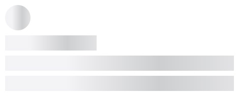

# 骨架屏动画

## 引入

```js
import 'oipage/stylecss/skeleton.css'
```

## 使用

比如我们有个区域，结构如下：

> 页面的布局和每个元素的尺寸设置好了，只是没有背景等显示UI。

```html
<div>
    <div></div>
    <div></div>
    <div></div>
    <div></div>
</div>
```

如何出现骨架屏效果？很简单，只需要：

```html
<div class="stylecss-skeleton">
    <div></div>
    <div></div>
    <div></div>
    <div></div>
</div>
```

显示效果如下（下面是截图，实际有动画效果）：



当然，有时候你可能只是需要个别条目出现骨架屏效果，类似这里可以修改为（这里是所有条目）：

```html
<div>
    <div class="stylecss-skeleton_item"></div>
    <div class="stylecss-skeleton_item"></div>
    <div class="stylecss-skeleton_item"></div>
    <div class="stylecss-skeleton_item"></div>
</div>
```

运行的效果和上面一样。

完整的例子代码你可以访问： [../../test/skeleton.html](../../test/skeleton.html) 。